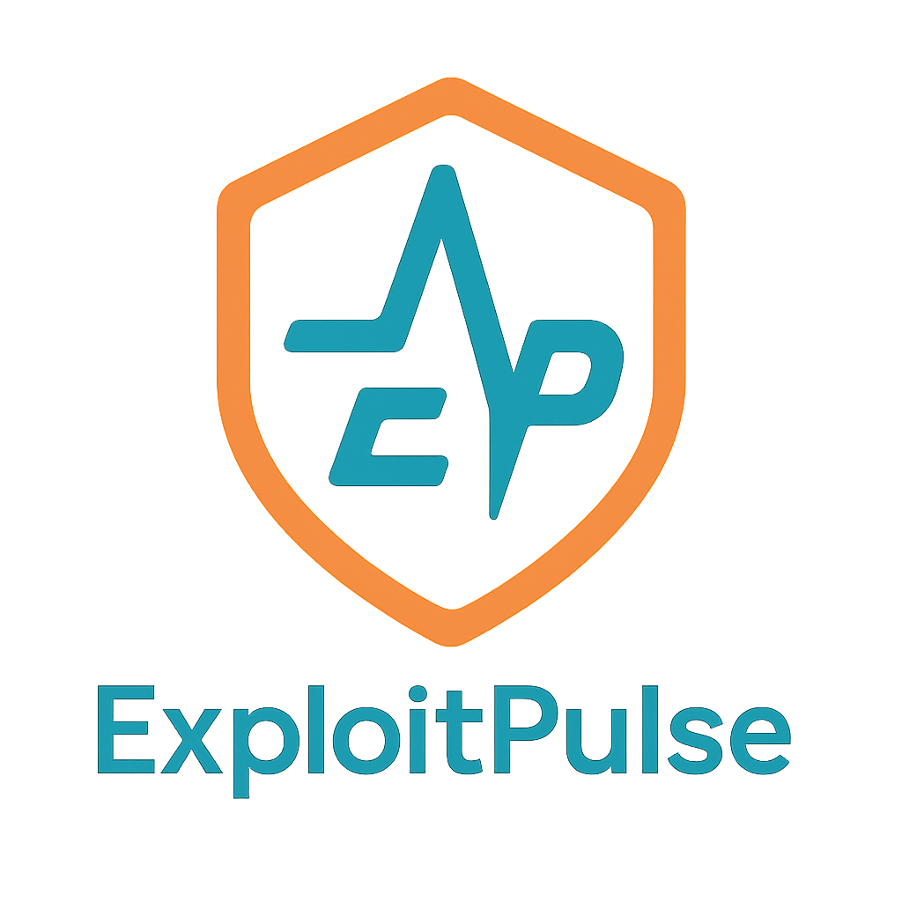

<p align="center">
  
</p>

# ExploitPulse

<p align="center">
  <a href="CONTRIBUTING.md">Contributing</a> •
  <a href="ROADMAP.md">Roadmap</a> •
  <a href="SECURITY.md">Security Policy</a> •
  <a href="CODE_OF_CONDUCT.md">Code of Conduct</a>
</p>


**Modern Vulnerability Intelligence & ETL Platform**

Integrate, validate, and analyze CVE, EPSS, KEV, NVD, ExploitDB, and more in PostgreSQL with scheduled or on-demand updates.

ExploitPulse is a modern, Dockerized ETL system for downloading, processing, and exploring vulnerability intelligence data from EPSS, CISA KEV, MITRE, NVD, ExploitDB, Vulnrichment, and more—all in PostgreSQL. Built for extensibility, validation, and actionable security analytics.

---

## Project Status: Independent Development (2025-05)

This repository is now an independent project, maintained and extended by the Nickorlabs team. ExploitPulse is focused on robust, extensible ETL for vulnerability intelligence, with strong validation and a modern, reproducible stack.

**Data Refresh:**
ExploitPulse supports scheduled (e.g., daily or hourly via cron) or on-demand ETL jobs for all supported vulnerability data sources. True real-time streaming is not currently implemented.

---

## Secret Management & Security
- **Secrets, API keys, and passwords must never be committed to the repository.**
- All sensitive values are managed via Docker secrets or environment variables.
- The `.gitignore` file enforces exclusion of secrets and log files from version control.
- This ensures project security and compliance with best practices for open-source and enterprise development.

## Log File Handling
- All log files are excluded from version control via `.gitignore`.
- This prevents accidental commits of large files and keeps the repository clean and efficient.

## Major ETL Features & Best Practices
- All ETL scripts (MITRE, NVD, KEV, EPSS, Vulnrichment, ExploitDB) are implemented in Python for maintainability and performance.
- Features include parallel processing, batch upserts, robust retry logic, and detailed logging.
- Each ETL job should be run individually for best results and troubleshooting.
- Legacy shell scripts and MySQL support are archived and no longer maintained.

---

## Project Structure

```
/opt/ExploitPulse/
├── README.md, LICENSE, PULL_REQUEST.md
├── etl/
│   ├── Dockerfile.importer
│   ├── docker-compose.yml
│   ├── requirements.txt
│   ├── update_epss.py         # Python ETL: EPSS
│   ├── update_kev.py          # Python ETL: CISA KEV
│   ├── update_cpe.py          # Python ETL: CPE (NVD CPE Dictionary)
│   ├── update_vulnrich.py     # Python ETL: Vulnrichment
│   ├── update_exploitdb.py    # Python ETL: ExploitDB (exploits, tags, metadata)
│   └── update_all.py          # Run all ETL jobs in sequence
├── etl/epss-data/         # EPSS data storage (auto-downloaded)
├── etl/vulnrichment/      # Vulnrichment repo (auto-cloned)
├── etl/exploitdb-data/    # ExploitDB CSV/temp storage (auto-downloaded, auto-removed after ETL)
├── archive/               # Legacy scripts, configs, and old data
├── docker/, docs/, tests/
└── ...
```

---

## Usage

### Running ETL Scripts with `--dry-run`

Both `update_kev.py` and `update_exploitdb.py` support a `--dry-run` (or `-n`) flag. This allows you to simulate the ETL process without making any changes to the database. All database operations (inserts, updates, deletes) will be logged but not executed.

#### Example: KEV ETL Dry Run
```bash
docker compose run --rm importer python /scripts/update_kev.py --dry-run
```

#### Example: ExploitDB ETL Dry Run
```bash
docker compose run --rm importer python /scripts/update_exploitdb.py --dry-run
```

- When run with `--dry-run`, the script logs all actions it would take, including upserts and schema changes, but does **not** modify the database.
- The logs will include `[DRY RUN]` prefixes for all simulated database operations and a summary at the end.

### Real Run (No Dry Run)
To perform the actual ETL and write changes to the database, simply omit the `--dry-run` flag:

```bash
docker compose run --rm importer python /scripts/update_exploitdb.py
```

### Metrics & Summary Output
At the end of each ETL run (dry or real), a summary is logged, including:
- Number of records fetched
- Number of records inserted, updated, deleted
- Number of errors and skipped records

**Example summary (dry run):**
```
[DRY RUN] Would insert 46781 records, update 0, delete 0.
[DRY RUN] Fetched 46781 records. Skipped: 0. Errors: 0.
```
**Example summary (real run):**
```
[SUMMARY] Inserted 46781 records, updated 0, deleted 0.
[SUMMARY] Fetched 46781 records. Skipped: 0. Errors: 0.
```

### Schema Correction
The ETL scripts will automatically ensure that required unique constraints exist on the database tables (e.g., `exploits (cve_id, source_id)`).

---


### 1. Start the Database
From the `etl` directory, start the database container:
```bash
docker compose up -d db
```

### 2. Run Each ETL Import Individually
For best results, run each ETL update script one at a time. This makes troubleshooting easier and avoids resource contention.

Below are all supported command-line options for each ETL job, with recommended defaults and example commands:

#### **MITRE ETL (`update_mitre.py`)
- `--mode` (`full` or `incremental`, default: `incremental`): Import all CVEs or only new/changed ones.
- `--workers` (default: 4): Number of parallel worker processes.
- `--batch-size` (default: 100): Batch size for DB upserts.
- `--verbosity` (0-3, default: 1): Verbosity level for logs.

**Example:**
```bash
docker compose run --rm mitre_importer python /scripts/update_mitre.py --mode incremental --workers 4 --batch-size 100 --verbosity 1
```

#### **CPE ETL (`update_cpe.py`)
- Supports `--dry-run` (or `-n`) to simulate the ETL without DB changes.
- `--batch-size` (default: 1000): Batch size for DB upserts (if supported).

**Dry Run Example:**
```bash
docker compose run --rm importer python /scripts/update_cpe.py --dry-run
```
**Real Run Example:**
```bash
docker compose run --rm importer python /scripts/update_cpe.py
```
- When run with `--dry-run`, all database operations (inserts, updates) are logged but not executed.
- At the end, a summary of inserts, updates, deletes, errors, and fetched records is logged, just like the other ETL scripts.

#### **NVD ETL (`update_nvd.py`)
- `--mode` (`full` or `incremental`, default: `incremental`): Import all or only new/updated CVEs.
- `--workers` (default: 4): Number of parallel workers for fetching.
- `--batch-size` (default: 2000): Batch size for API and DB operations.

**Example:**
```bash
docker compose run --rm nvd_importer python /scripts/update_nvd.py --mode incremental --workers 4 --batch-size 2000
```

#### **KEV ETL (`update_kev.py`)
- Supports `--dry-run` (or `-n`) to simulate the ETL without DB changes.

**Dry Run Example:**
```bash
docker compose run --rm importer python /scripts/update_kev.py --dry-run
```
**Real Run Example:**
```bash
docker compose run --rm importer python /scripts/update_kev.py
```
- At the end, a summary of inserts, updates, deletes, errors, and fetched records is logged. In dry run mode, all DB operations are logged but not executed.

#### **EPSS ETL (`update_epss.py`)
- Supports `--dry-run` (or `-n`) to simulate the ETL without DB changes.
- `--mode` (`full` or `incremental`, default: `incremental`): Import all EPSS data or only new data.

**Dry Run Example:**
```bash
docker compose run --rm importer python /scripts/update_epss.py --mode incremental --dry-run
```
**Real Run Example:**
```bash
docker compose run --rm importer python /scripts/update_epss.py --mode incremental
```
- At the end, a summary of inserts, updates, deletes, errors, and fetched records is logged. In dry run mode, all DB operations are logged but not executed.

#### **Vulnrichment ETL (`update_vulnrich.py`)
- `--mode` (`incremental` or `full`, default: `incremental`): Import only new/changed or all records.
- `--workers` (default: 4): Number of parallel worker threads.
- `--batch-size` (default: 1000): Batch size for DB upserts.

**Example:**
```bash
docker compose run --rm vulnrich_importer python /scripts/update_vulnrich.py --mode incremental --workers 4 --batch-size 1000
```

#### **ExploitDB ETL (`update_exploitdb.py`)
- Supports `--dry-run` (or `-n`) to simulate the ETL without DB changes.

**Dry Run Example:**
```bash
docker compose run --rm importer python /scripts/update_exploitdb.py --dry-run
```
**Real Run Example:**
```bash
docker compose run --rm importer python /scripts/update_exploitdb.py
```
- At the end, a summary of inserts, updates, deletes, errors, and fetched records is logged. In dry run mode, all DB operations are logged but not executed.

> **Note:** Use `--mode full` for a full re-import if needed. The default is usually incremental for scripts that support it.

Repeat for any other ETL scripts as needed.

> **Note:** Running `update_all.py` is not recommended for large imports or troubleshooting. Run each update individually for best results.

### 3. Query the data in PostgreSQL
Use `psql` or any SQL client to explore tables:
- `epssdb` (EPSS scores)
- `kevcatalog` (CISA KEV)
- `vulnrichment` (Vulnrichment details)
- `exploits`, `exploit_tags`, `exploit_metadata` (ExploitDB and related tables)
- All tables are in the `epssdb` database by default.

---

## Data Validation & Integrity
- **Inline validation**: All MITRE and NVD CVE imports now include inline validation—every record is checked after import to ensure database fields match the original source data.
- **Integrity-first ETL**: This pattern will be extended to all other feeds (ExploitDB, OSV, Snyk, etc.) for robust, auditable data quality.
- **Validation mismatches** (if any) are logged with details for rapid debugging.

---

## Next Steps
- Extend inline validation to all other feeds (ExploitDB, OSV, Snyk, etc.)
- UI frontend for data exploration (coming soon)
- See [issues](https://github.com/nickorlabs/ExploitPulse/issues) for roadmap

# Test Suite

This repository includes a test suite that verifies the functionality of the scripts and their ability to access external data sources. The test suite is located in the `/tests` directory.

## Running the Tests

To run the tests, simply execute the `test-scripts.sh` script from the repository root:

```bash
./tests/test-scripts.sh
```

The test suite checks:

1. **Dynamic Path Detection** - Verifies that all scripts use dynamic path detection
2. **Configuration Access** - Ensures scripts can find configuration files
3. **URL Verification** - Checks that all data source URLs are correctly configured and accessible
   - EPSS data URLs (now using epss.empiricalsecurity.com)
   - KEV Catalog URLs
   - Vulnrichment repository access
4. **Script Cross-References** - Verifies that scripts can find and execute other scripts

Running the tests is a good way to verify that your installation is configured correctly.
