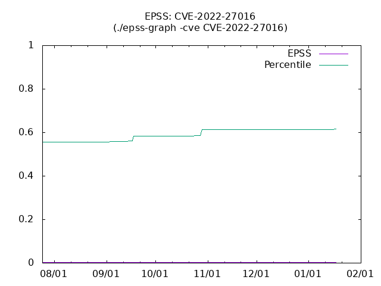
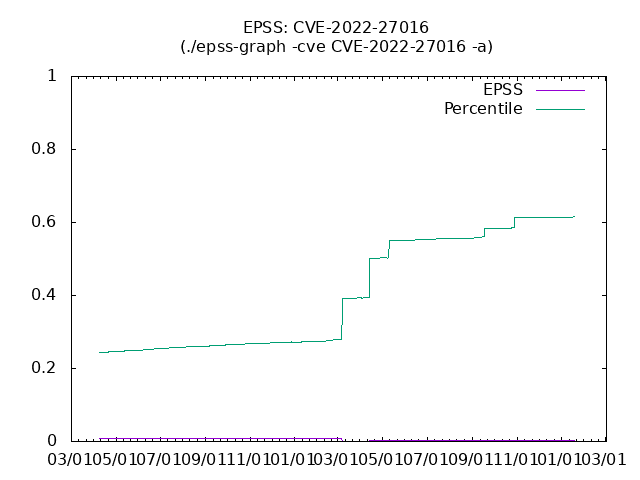

<p align="center">
  
</p>

# ExploitPulse

<p align="center">
  <a href="CONTRIBUTING.md">Contributing</a> •
  <a href="ROADMAP.md">Roadmap</a> •
  <a href="SECURITY.md">Security Policy</a> •
  <a href="CODE_OF_CONDUCT.md">Code of Conduct</a>
</p>


**Modern Vulnerability Intelligence & ETL Platform**

Integrate, validate, and analyze CVE, EPSS, KEV, NVD, ExploitDB, and more in PostgreSQL with scheduled or on-demand updates.

ExploitPulse is a modern, Dockerized ETL system for downloading, processing, and exploring vulnerability intelligence data from EPSS, CISA KEV, MITRE, NVD, ExploitDB, Vulnrichment, and more—all in PostgreSQL. Built for extensibility, validation, and actionable security analytics.

---

## Project Status: Independent Development (2025-05)

This repository is now an independent project, maintained and extended by the Nickorlabs team. ExploitPulse is focused on robust, extensible ETL for vulnerability intelligence, with strong validation and a modern, reproducible stack.

**Data Refresh:**
ExploitPulse supports scheduled (e.g., daily or hourly via cron) or on-demand ETL jobs for all supported vulnerability data sources. True real-time streaming is not currently implemented.

## Major Update: Python & Docker Migration (2025-05)

- **All data import and ETL workflows are now implemented in Python.**
- **PostgreSQL** is the supported database (MySQL support is deprecated).
- **Legacy shell scripts and MySQL configs are archived** in `/archive/`.
- **Docker Compose** is used for reproducible, multi-service orchestration.
- **Robust Docker volume mapping** ensures all MITRE/NVD/ExploitDB data is accessible inside containers.
- **Data sources:**
  - EPSS (Empirical Security)
  - CISA Known Exploited Vulnerabilities (KEV)
  - CISA Vulnrichment
  - MITRE CVE (full cvelistV5 integration)
  - NVD CVE (integrated and validated)
  - ExploitDB (Offensive Security Exploit Database)
- **Extensible:** Easy to add new data sources or analytics.

---

## Project Structure

```
/opt/ExploitPulse/
├── README.md, LICENSE, PULL_REQUEST.md
├── etl/
│   ├── Dockerfile.importer
│   ├── docker-compose.yml
│   ├── requirements.txt
│   ├── update_epss.py         # Python ETL: EPSS
│   ├── update_kev.py          # Python ETL: CISA KEV
│   ├── update_vulnrich.py     # Python ETL: Vulnrichment
│   ├── update_exploitdb.py    # Python ETL: ExploitDB (exploits, tags, metadata)
│   └── update_all.py          # Run all ETL jobs in sequence
├── etl/epss-data/         # EPSS data storage (auto-downloaded)
├── etl/vulnrichment/      # Vulnrichment repo (auto-cloned)
├── etl/exploitdb-data/    # ExploitDB CSV/temp storage (auto-downloaded, auto-removed after ETL)
├── archive/               # Legacy scripts, configs, and old data
├── docker/, docs/, tests/
└── ...
```

---

## Usage

### 1. Start the Database
From the `etl` directory, start the database container:
```bash
docker compose up -d db
```

### 2. Run Each ETL Import Individually
For best results (especially with large datasets), run each ETL update script one at a time. This makes troubleshooting easier and avoids resource contention.

Example commands:

**Exploits:**
```bash
docker compose run --rm importer python update_exploitdb.py
```
**NVD:**
```bash
docker compose run --rm importer python update_nvd.py
```
**MITRE:**
```bash
docker compose run --rm importer python update_mitre.py
```
**EPSS:**
```bash
docker compose run --rm importer python update_epss.py
```
**KEV:**
```bash
docker compose run --rm importer python update_kev.py
```
**Vulnrichment:**
```bash
docker compose run --rm importer python update_vulnrich.py
```

Repeat for any other ETL scripts as needed.

> **Note:** Running `update_all.py` is not recommended for large imports or troubleshooting. Run each update individually for best results.

### 3. Query the data in PostgreSQL
Use `psql` or any SQL client to explore tables:
- `epssdb` (EPSS scores)
- `kevcatalog` (CISA KEV)
- `vulnrichment` (Vulnrichment details)
- `exploits`, `exploit_tags`, `exploit_metadata` (ExploitDB and related tables)
- All tables are in the `epssdb` database by default.

---

## Legacy Scripts
All old shell scripts and MySQL configs are archived in `/archive/` and are no longer maintained. Use the new Python ETL scripts for all workflows.

---

## Data Validation & Integrity
- **Inline validation**: All MITRE and NVD CVE imports now include inline validation—every record is checked after import to ensure database fields match the original source data.
- **Integrity-first ETL**: This pattern will be extended to all other feeds (ExploitDB, OSV, Snyk, etc.) for robust, auditable data quality.
- **Validation mismatches** (if any) are logged with details for rapid debugging.

---

## Next Steps
- Extend inline validation to all other feeds (ExploitDB, OSV, Snyk, etc.)
- UI frontend for data exploration (coming soon)
- See [issues](https://github.com/nickorlabs/ExploitPulse/issues) for roadmap

---

## Appendix: Legacy Project Info

The following section preserves the original project structure and setup/usage from the legacy (MySQL/shell) version of this repository. This is for historical reference only. **For all new deployments and usage, follow the main instructions above.**

### Original Directory Structure
```
/opt/ExploitPulse
|-- Documents
|   |-- epss-graph.png
|   `-- epss-graph_-a.png
|-- LICENSE
|-- README.md
|-- docker
|   |-- Dockerfile
|   |-- README.md
|   `-- env
|-- epss-graph.sh
|-- init-script
|   |-- epss-init.sh
|   |-- kev-init.sh
|   `-- vulnrichment-init.sh
|-- my.cnf
|-- queryConsole.sh
|-- skel
|   `-- plot.plt
|-- subprogram
|   |-- epss-add.sh
|   `-- vulnrichUpdate.sh
|-- update-all.sh
|-- update-epss.sh
|-- update-kev.sh
`-- update-vulnrich.sh
```

### Legacy Setup & Usage
#### Docker Image
```
$ docker pull hogehuga/ExploitPulse
```

#### Create Docker Volumes
```
$ docker volume create epssDB
$ docker volume create epssFile
```

#### Run Container (legacy)
```
$ docker container run --name epssdb -v epssDB:/var/lib/mysql -v epssFile:/opt/ExploitPulse/epss-data -e MYSQL_ROOT_PASSWORD=mysql -d hogehuga/ExploitPulse
```

#### Prepare Data (legacy)
```
$ docker exec -it epssdb /bin/bash
# cd /opt/ExploitPulse/init-script
# ./epss-init.sh
```

#### Optional: KEV Catalog (legacy)
```
$ docker exec -it epssdb /bin/bash
# cd /opt/ExploitPulse/init-script
# ./kev-init.sh
```

#### Experimental: Vulnrichment (legacy)
```
$ docker exec -it epssdb /bin/bash
# cd /opt/ExploitPulse/init-script
# ./vulnrichment-init.sh
```

#### Notes
- The original project used MySQL, shell scripts, and manual volume management.
- Data was stored in `.gz` files and loaded via MySQL scripts.
- All new workflows use Python, PostgreSQL, and Docker Compose for a modern, unified ETL experience.

---

**Contributions and PRs are welcome!**
- 2023-12-04 JST
  - First release.

# What's This?

EPSS is Exploit Prediction Scoreing Syste from FIRST ( https://www.first.org/epss/ ).

I want to analyze EPSS, but I don't need to use SIEM, so I wanted something that could be analyzed using SQL.
We thought it was important to first implement something simple and have it widely used.

And The KEV catalog is now also included in the database. I think the range of use will be further expanded by combining it with EPSS's cveID.

An environment where Docker can be executed is required.

# System configuration

## REQUIRE

- docker
- HOST disc space
  - EPSS .csv.gz file  : 1[GB]
  - EPSS mysql database: 40[GB]
- Ability to write SQL statements ...

## File and Directory


```
/opt/ExploitPulse
|-- Documents
|   |-- epss-graph.png
|   `-- epss-graph_-a.png
|-- LICENSE
|-- README.md
|-- docker
|   |-- Dockerfile
|   |-- README.md
|   `-- env
|-- epss-graph.sh
|-- init-script
|   |-- epss-init.sh
|   |-- kev-init.sh
|   `-- vulnrichment-init.sh
|-- my.cnf
|-- queryConsole.sh
|-- skel
|   `-- plot.plt
|-- subprogram
|   |-- epss-add.sh
|   `-- vulnrichUpdate.sh
|-- update-all.sh
|-- update-epss.sh
|-- update-kev.sh
`-- update-vulnrich.sh
```

- epss-graph.sh
  - Once you pass your CVE-ID, a graph will show you your EPSS and percentile changes over the past 180 days.
- epss-data
  - The contents differ depending on when the data was provided, so we save it separately in 1st/2nd/3rd directories.
  - Download EPSS .gz data.
  - and store MySQL Load file.
- init-script/
  - The first script to run when using EPSS, KEV Catalog, Vulnrichment.
- my.cnf
  - Settings for accessing the mysql console.
- queryConsole.sh
  - This is a script to easily open the mysql console.
- skel
  - skelton(template) file directory.
- subprogram
  - epss-add.sh
    - This is a script that downloads data for a specific day and registers it in the database.
  - vulnrichUpdate.sh
- update-all.sh
  - alias for execute all update script(update-epss/kev/vunrich)
- update-epss.sh
  - Update EPSS database.
- update-kev.sh
  - Update KEV Catalog database.
- update-vulnrich.sh
  - Update Vulnrichment database.


# How to use this.

## setup EPSS database

Get Dockaer image

```
$ docker pull hogehuga/ExploitPulse
```

Create docker volume
- mysql database data: `epssDB` volme
- epss .csv.gz file: `epssFile` volume

```
$ docker volume create epssDB
$ docker volume create epssFile
```

Run container
- If you want to share the "share" directory for sharing analysis results, please add `-v <yourShredDirctory>:/opt/ExploitPulse/share`.
  - eg. container:/opt/ExploitPulse/share , host sahred:/home/hogehuga/share. -> `-v /home/hogehuga/share:/opt/ExploitPulse/share`
```
$ docker container run --name epssdb -v epssDB:/var/lib/mysql -v epssFile:/opt/ExploitPulse/epss-data -e MYSQL_ROOT_PASSWORD=mysql -d hogehuga/ExploitPulse
```

Prepare the data
```
$ docker exec -it epssdb /bin/bash
(work inside a container)
# cd /opt/ExploitPulse/init-script
# ./epss-init.sh
```

Once your data is ready, all you need to do is use it!


### optional: KEV Catalog

run EPSS container.

Init for The KEV Catalog database.
```
$ docker exec -it epssdb /bin/bash
(work inside a container)
# cd /opt/ExploitPulse/init-script
# ./kev-init.sh
```

### experimental: Vunlrichment

run EPSS container

Init for The Vulnrichment database
```
$ docker exec -it epssdb /bin/bash
(work inside a container)
# cd /opt/ExploitPulse/init-script
# ./vulnrichment-init.sh
```

This script will:
1. Create the necessary database tables
2. Clone the official CISA Vulnrichment repository (https://github.com/cisagov/vulnrichment)


## Data analysis: EPSS

Enter the container and use SQL commands to perform analysis.

```
$ docker exec -it epssdb /bin/bash
(work inside a container)
# cd /opt/ExploitPulse
# ./epssquery.sh
mysql> select * from epssdb limit 1;
+----+---------------+---------+------------+-------+------------+
| id | cve           | epss    | percentile | model | date       |
+----+---------------+---------+------------+-------+------------+
|  1 | CVE-2020-5902 | 0.65117 |       NULL | NULL  | 2021-04-14 |
+----+---------------+---------+------------+-------+------------+
1 row in set (0.00 sec)

mysql>
```

## epss-graph.sh

Create EPSS and percentile charts and CSV data for the past 180 days.
- Using the `-a` option will create the graph using all the data present in the database.
- Data will be created under ./shera directory
  - <CVE-ID>.csv: CSV data
  - ExploitPulse<CVE-ID>.png: Graph
  - skel-<CVE-ID>.plt: gnuplot script. Template is `./skel/plot.plt`

If you want to change gnuplot options, edit the skel-<CVE-ID>.plt file.
- edit skel-<CVE-ID>.plt file
  - tile, tics, label, etc...
- Pass skel to gnuplot and draw the graph.
  - `# LANG=C.utf8 gnuplot skel-<CVE-ID>.plt`

```
# ./epss-graph.sh -cve "CVE-2022-27016"
; -> ./share/CVE-2022-27016.csv (from:180 days ago)
; -> ./share/ExploitPulseCVE-2022-27016.png

# ./epss-graph.sh -cve "CVE-2022-27016" -a
; -> Similar to above, but creates images for all registered periods

```




## Update EPSS data

Automatically registers data from the last registered data to the latest data in the database.

```
# ./epss-autoAdd.sh
```

## Update ExploitPulse

`git pull origin` or rebuild container.

```
# cd /opt/ExploitPulse
# git pull origin
```

```
on HOST

$ docker stop epssdb
$ docker pull hogehuga/ExploitPulse
$ docker container run --name epssdbNEWNAME -v epssDB:/var/lib/mysql -v epssFile:/opt/ExploitPulse/epss-data -e MYSQL_ROOT_PASSWORD=mysql -d hogehuga/ExploitPulse
  ; Please specify the same value as last time

NOTE:
- Databases(/var/lib/mysql as "epssDB" docker volume) and files(/opt/ExploitPulse/epss-data as "epssFile" docker volume) will be inherited.
```

## Optional: KEV Catalog search

At the moment, we are using SQL.

```
$ docker exec -it epssdb /bin/bash
(work inside a container)
# cd /opt/ExploitPulse
# ./epssquery.sh
mysql> select YEAR(dateAdded) as year, count(dateAdded) as count from kevcatalog group by year ;
+------+-------+
| year | count |
+------+-------+
| 2021 |   311 |
| 2022 |   555 |
| 2023 |   187 |
| 2024 |    51 |
+------+-------+
4 rows in set (0.00 sec)

mysql> select epssdb.cve, epssdb.epss, epssdb.percentile, kevcatalog.dateAdded, kevcatalog.vendorProject, kevcatalog.knownRansomwareCampaignUse from epssdb INNER JOIN kevcatalog ON epssdb.cve = kevcatalog.cveID where epssdb.cve="CVE-2021-44529" and epssdb.date="2024-04-20";
+----------------+---------+------------+------------+---------------+----------------------------+
| cve            | epss    | percentile | dateAdded  | vendorProject | knownRansomwareCampaignUse |
+----------------+---------+------------+------------+---------------+----------------------------+
| CVE-2021-44529 | 0.97068 |    0.99757 | 2024-03-25 | Ivanti        | Unknown                    |
+----------------+---------+------------+------------+---------------+----------------------------+
1 row in set (0.09 sec)

mysql>
```

## Optional: KEV Catalog update

Unlike CVSS etc., it does not provide differences, so please delete the database and re-register it.

```
# cd /opt/ExploitPulse
# ./kev-refresh.sh
CVE-nnnn-nnnn
...
#
```

- As of May 2024, it takes about 1 minute and 30 seconds to complete in my environment.


## Experimental: Vulnrichment search

```
mysql> select adpSSVCAutomatable, count(*) from summary group by adpSSVCAutomatable;
+--------------------+----------+
| adpSSVCAutomatable | count(*) |
+--------------------+----------+
| no                 |     2653 |
| Yes                |      558 |
|                    |       41 |
+--------------------+----------+
3 rows in set (0.01 sec)

mysql>
```

## Experimental: Vulnrichment update

**Important**: Before running the update script for the first time, you must initialize the Vulnrichment database using the `vulnrichment-init.sh` script as described in the setup section above.

To update the Vulnrichment data after initialization:

```
# cd /opt/ExploitPulse
# ./update-vulnrich.sh
```

This script will:
1. Pull the latest updates from the CISA Vulnrichment repository
2. Process the JSON files into CSV format
3. Import the data into the MySQL database

## Experimental: Vulnrichment remove

1. remove from database

```
# /opt/ExploitPulse/queryConsole.sh
> drop table richment;
```

2. remove local repositories file

```
# rm -rf /opt/ExploitPulse/ulnrichment
```


# technical note

## EPSS data

| Field      | Type        |
|:-----------|:------------|
| id         | int         |
| cve        | varchar(20) |
| epss       | double      |
| percentile | double      |
| model      | varchar(20) |
| date       | date        |

## KEV Catalog data

https://www.cisa.gov/known-exploited-vulnerabilities-catalog
- Schema is https://www.cisa.gov/sites/default/files/feeds/known_exploited_vulnerabilities_schema.json

|field                     |original json type|note                      |mysql Table  |
|:-------------------------|:-----------------|:-------------------------|-------------|
|id                        |(not exist)       |(for RDBMS)               |int, not Null|
|cveID                     |string            |^CVE-[0-9]{4}-[0-9]{4,19}$|varchar(20)  |
|vendorProject             |string            |                          |text         |
|product                   |string            |                          |text         |
|vulnerabilityName         |string            |                          |text         |
|dateAdded                 |string            |format: YYYY-MM-DD        |date         |
|shortDescription          |string            |                          |text         |
|requiredAction            |string            |                          |text         |
|dueDate                   |string            |format: YYYY-MM-DD        |date         |
|knownRansomwareCampaignUse|string            |(Known or Unknown only?)  |text         |
|notes                     |string            |                          |text         |

# Test Suite

This repository includes a test suite that verifies the functionality of the scripts and their ability to access external data sources. The test suite is located in the `/tests` directory.

## Running the Tests

To run the tests, simply execute the `test-scripts.sh` script from the repository root:

```bash
./tests/test-scripts.sh
```

The test suite checks:

1. **Dynamic Path Detection** - Verifies that all scripts use dynamic path detection
2. **Configuration Access** - Ensures scripts can find configuration files
3. **URL Verification** - Checks that all data source URLs are correctly configured and accessible
   - EPSS data URLs (now using epss.empiricalsecurity.com)
   - KEV Catalog URLs
   - Vulnrichment repository access
4. **Script Cross-References** - Verifies that scripts can find and execute other scripts

Running the tests is a good way to verify that your installation is configured correctly.
